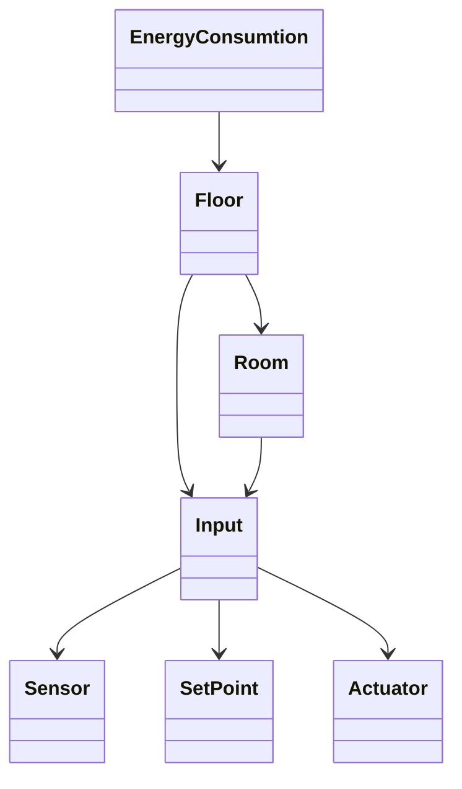

```mermaid
classDiagram
    class Actuator{

    }

    class Sensor{

    }

    class Input{

    }

    class SetPoint{

    }

    class Floor{

    }

    class Room{

    }

    class EnergyConsumtion{

    }

    Input --> Sensor
    Input --> SetPoint
    Input --> Actuator
    Floor --> Room
    Floor --> Input
    Room --> Input
    EnergyConsumtion --> Floor
```